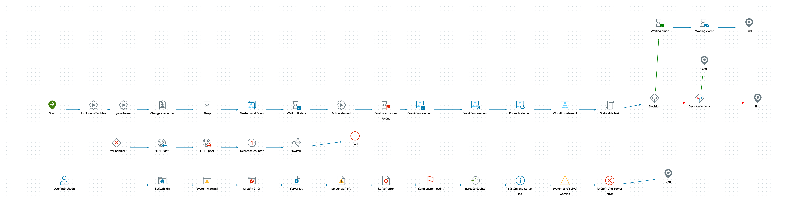

# Workflow Documentation Tool for Aria Automation Orchestrator (WDT4vRO)

[](https://wdt4vro.vercel.app/)
[](https://github.com/imtrinity94/WDT4vRO/releases/tag/v2.0.0)

A comprehensive visualization and documentation tool that converts XML-based workflow definitions from VMware VCF Operations Orchestrator (formerly Aria Automation Orchestrator or vRealize Orchestrator) into intuitive, interactive diagrams. This tool helps teams understand, document, and maintain complex workflows with ease.

🌐 **Try Online**: [https://wdt4vro.vercel.app/](https://wdt4vro.vercel.app/)

## 🚀 What's New in v2.0.0

- **Enhanced Script Display**: Improved script viewing with syntax highlighting and better handling of script content in custom conditions.
- **Improved Workflow Item Handling**: Better support for custom conditions and more accurate display of workflow item properties.
- **UI/UX Improvements**: Updated welcome screen with version information, better error handling, and an improved layout for workflow details.

## Screenshots

### Homescreen


### Generated Workflow Schema


### Generated Metadata Tables and Scripts Tables


## 🌟 Key Features

- **📝 XML Workflow Import**: Directly upload XML workflow files and get instant visualizations.
- **🎨 Intelligent Visualization**: Automatic layout of workflow elements with color-coded nodes and custom icons.
- **🔍 Interactive Interface**: Zoom, pan, and view detailed tooltips on hover.
- **📄 Comprehensive Documentation**: Automatic metadata extraction, input/output parameter documentation, and a detailed workflow element panel.

## 🚀 Getting Started

### Option 1: Use Online Version (Recommended)
1. Go to [https://wdt4vro.vercel.app/](https://wdt4vro.vercel.app/).
2. Click "Upload Workflow" and select your XML file.

### Option 2: Run Locally
1. **Clone the repository**:
   ```bash
   git clone https://github.com/imtrinity94/WDT4vRO.git
   cd WDT4vRO
   ```
2. **Run a local server**:
   ```bash
   python -m http.server 8000
   ```
3. **Open in your browser**:
   Navigate to `http://localhost:8000`.

## 🛠️ For Developers

### Project Structure

```
WDT4vRO/
├── assets/               # Static assets and images
├── icons/                # Workflow element icons
├── Sample Workflow XMLs/ # Example workflow files
├── index.html            # Main application file
├── full.render.js        # Graphviz renderer (legacy)
└── README.md             # This file
```

### Development Setup

1. **Prerequisites**:
   - A modern web browser (Chrome, Firefox, Edge).
   - A local web server (Python's `http.server`, `live-server` for Node.js, etc.).

2. **Running the Application**:
   - The application is a single `index.html` file with embedded CSS and JavaScript.
   - You can open `index.html` directly in your browser, but it's recommended to use a local server to avoid potential CORS issues with file loading.

### Code Overview

- **`index.html`**: The main entry point of the application. It contains the HTML structure, CSS for styling, and JavaScript for all the application logic, including:
  - **File Upload and Parsing**: Handles XML file uploads and parses the workflow data.
  - **Graph Generation**: Creates the workflow diagram using SVG and `foreignObject` for HTML content within the SVG.
  - **Details Pane**: Generates the detailed view of workflow items, including input/output parameters and scripts.
  - **Monaco Editor Integration**: Provides syntax highlighting for scripts.
  - **Export Functionality**: Handles exporting the diagram to PNG and the full documentation to HTML.

- **`icons/`**: Contains SVG icons for different workflow item types. The `getIconForNode` function in `index.html` maps workflow item types to these icons.

- **`assets/`**: Includes images and other static files used in the UI.

## 🤝 Contributing

We welcome contributions! Here's how you can help:

1. **Report Issues**: Found a bug or have a feature request? [Open an issue](https://github.com/imtrinity94/WDT4vRO/issues/new).
2. **Submit Pull Requests**: Fork the repository, create a feature branch, and submit a pull request with your changes.
3. **Improve Documentation**: Update the README, add code comments, or write tutorials.

## 📄 License

This project is licensed under the MIT License - see the [LICENSE](LICENSE) file for details.
