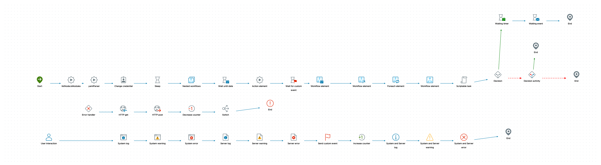

> [!IMPORTANT]
> **This project is archived and no longer maintained.** It has been succeeded by **[vRO Peekage](https://vro-peekage.vercel.app/)** ([source](https://github.com/imtrinity94/vRO-Package-Viewer)).
>
> vRO Peekage keeps WDT4vRO's Orchestrator-style workflow diagrams and adds much more. Drop in a whole `.package` exported from vRealize Orchestrator 7.x, Aria Automation Orchestrator 8.x or VCF Operations Orchestrator 9.x, and browse every workflow schema, action, script, configuration and resource element, and recorded run. You can then export everything as a report, diagrams and script files.
>
> The [WDT4vRO web app](https://wdt4vro.vercel.app/) stays online and keeps working as it is, but it won't receive updates or fixes.

# Workflow Documentation Tool for Aria Automation Orchestrator (WDT4vRO) v2.1.0

[](https://wdt4vro.vercel.app/)
[](https://github.com/imtrinity94/WDT4vRO/releases/tag/v2.1.0)

A comprehensive visualization and documentation tool that converts XML-based workflow definitions from VMware VCF Operations Orchestrator (aka Aria Automation Orchestrator or vRealize Orchestrator) into intuitive, interactive diagrams. This tool helps teams understand, document, and maintain complex workflows with ease.

🌐 **Try Online**: [https://wdt4vro.vercel.app/](https://wdt4vro.vercel.app/)

> [!WARNING]
> **Production Warning:** For production workflows, always compare the generated PDFs, HTMLs, and PNGs with the actual workflow in **VCF Operations Orchestrator** to ensure 100% accuracy.

## 🚀 What's New in v2.1.0

- **Brand New PDF Documentation Engine**
  - High-quality, multi-page PDF generation from workflow definitions.
  - Sliced pagination to prevent content duplication across page breaks.
  - Centered and scaled workflow diagrams on the first page.
  - Clean rendering of code blocks (replacing Monaco with readable `<pre>` tags for PDF).

- **Enhanced Diagram Rendering**
  - Correct rendering of all node icons directly from the internal library.
  - Improved arrow paths and marker placement.
  - Better handling of vRO workflows with complex or orphaned nodes.

- **UI/UX Improvements**
  - Unified typography for a cleaner first impression.
  - Dynamic progress reporting during file generation.
  - Improved layout for workflow details and metadata.

## Homescreen


## Generated Workflow Schema


## Generated Metadata Tables and Scripts Tables


## 🌟 Key Features

- **📝 XML Workflow Import**
  - Directly upload XML workflow files
  - Supports all standard vRO workflow elements
  - Automatic detection of workflow types and relationships

- **🎨 Intelligent Visualization**
  - Automatic layout of workflow elements
  - Color-coded nodes for different element types
  - Custom icons for different workflow actions
  - Support for async workflows and scheduled tasks

- **🔍 Interactive Interface**
  - Zoom and pan functionality
  - Detailed tooltips on hover
  - Responsive design for all devices
  - Full-screen mode for better visibility

- **📄 Comprehensive Documentation**
  - Automatic metadata extraction
  - Input/output parameter documentation
  - Workflow element details panel
  - Export functionality for sharing

## 🚀 Getting Started

### Quick Start

#### Option 1: Use Online Version (Recommended)
1. Go to [https://wdt4vro.onrender.com/](https://wdt4vro.onrender.com/)
2. Click "Upload Workflow" and select your XML file

#### Option 2: Run Locally
1. **Clone the repository**
   ```bash
   git clone https://github.com/imtrinity94/WDT4vRO.git
   cd WDT4vRO
   ```

2. **Run a local server**
   - Python 3:
     ```bash
     python -m http.server 8000
     ```
   - Or use any other local web server

3. **Open in browser**
   - Navigate to `http://localhost:8000`
   - Click "Upload Workflow" and select your XML file

## 🛠️ Usage Guide

### Uploading Workflows
1. Click the "Upload Workflow" button
2. Select your XML workflow file
3. The tool will automatically process and display the workflow

### Navigation
- **Zoom**: Use the +/- buttons or mouse wheel
- **Pan**: Click and drag the canvas
- **Reset View**: Click the home button

### Export Options
- **PDF**: Full documentation with diagram and details
- **PNG**: Download as high-resolution image
- **HTML**: Self-contained HTML export

## 🏗️ Project Structure

```
WDT4vRO/
├── assets/               # Static assets and images
│   ├── wdt4vro_icon.svg   # Application icon
│   └── wdt4vro-screenshot.png # Screenshot
├── icons/                 # Workflow element icons
│   ├── action.svg         # Action icon
│   ├── workflow-async.svg # Async workflow icon
│   ├── workflow-schedule.svg # Schedule workflow icon
│   └── ...
├── Sample Workflow XMLs/  # Example workflow files
│   └── all-workflow-element-polyglot.xml
├── index.html            # Main application file
├── full.render.js        # Graphviz renderer
├── README.md             # This file
└── LICENSE               # License information
```

## 🤝 Contributing

We welcome contributions! Here's how you can help:

1. **Report Issues**
   - Found a bug? Open an issue with steps to reproduce
   - Have a feature request? Let us know!

2. **Submit Pull Requests**
   - Fork the repository
   - Create a feature branch
   - Commit your changes
   - Push to your fork
   - Submit a pull request

3. **Improve Documentation**
   - Update README
   - Add code comments
   - Write tutorials or guides

## 📄 License

This project is licensed under the MIT License - see the [LICENSE](LICENSE) file for details.

## 📞 Support

For support, please:
1. Check the [Issues](https://github.com/imtrinity94/WDT4vRO/issues) page
2. If your issue isn't listed, create a new one
3. For direct contact, email support@example.com

## 📚 Resources

- [vRO Documentation](https://docs.vmware.com/en/vRealize-Orchestrator/)
- [Graphviz Documentation](https://graphviz.org/documentation/)
- [SVG Reference](https://developer.mozilla.org/en-US/docs/Web/SVG)

## 🌟 Special Thanks

- VMware for vRealize Orchestrator
- The Graphviz team
- All contributors and users

---

<div align="center">
  Made with ❤️ by the WDT4vRO Team
  
  ---
  
  <sub>VMware Aria Automation Orchestrator™ is a trademark of Broadcom Inc. This project is not affiliated with or endorsed by Broadcom Inc. or its subsidiaries.</sub>
</div>
